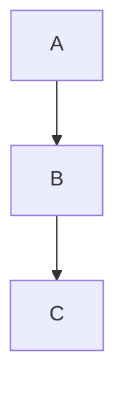

<!-- section:getting-started -->
# Erste Schritte

**VanFolio** ist ein ablenkungsfreier Markdown-Editor für Autoren und Entwickler.

## Neues Dokument erstellen

- Starten Sie VanFolio — ein leerer **Unbenannt**-Tab öffnet sich automatisch.
- Fangen Sie sofort an zu schreiben.
- Speichern Sie mit **Strg+S** — beim ersten Mal werden Sie nach einem Speicherort gefragt.
- Speichern Sie eine Kopie an einem anderen Ort mit **Strg+Umschalt+S**.

## Bestehende Datei öffnen

- **Datei → Datei öffnen** oder **Strg+O**
- Ziehen Sie eine `.md`-Datei direkt in das Editor-Fenster.
- Zuletzt verwendete Dateien werden im Bereich **Dateien** (linke Seitenleiste) aufgelistet.

## Tabs

- Klicken Sie auf **+**, um einen neuen leeren Tab zu öffnen.
- Öffnen Sie mehrere Dateien gleichzeitig — jede Datei erhält ihren eigenen Tab.
- Nicht gespeicherte Änderungen werden durch einen **●** Punkt auf dem Tab angezeigt.
- Schließen Sie einen Tab mit **×** oder mittlerem Mausklick.

## Automatisches Speichern

Sobald eine Datei mindestens einmal auf der Festplatte gespeichert wurde, speichert VanFolio sie während des Schreibens automatisch.

## Sitzungswiederherstellung

Wenn Sie VanFolio neu starten, werden Ihre vorherigen Tabs und Inhalte automatisch wiederhergestellt — sogar ungespeicherte Dokumente.

---

<!-- section:writing-and-tabs -->
# Schreiben & Tabs

## Slash-Befehle

Geben Sie an einer beliebigen Stelle im Editor `/` ein, um die Befehlspalette zu öffnen.

| Befehl | Ergebnis |
|---|---|
| `/h1` `/h2` `/h3` | Überschriften |
| `/bullet` | Aufzählungsliste |
| `/numbered` | Nummerierte Liste |
| `/todo` | To-Do-Checkliste |
| `/codeblock` | Codeblock |
| `/table` | Markdown-Tabelle |
| `/quote` | Zitat |
| `/hr` | Horizontale Linie |
| `/pagebreak` | Erzwungener Seitenumbruch |
| `/link` | Link einfügen |
| `/image` | Bild einfügen |
| `/mermaid` | Mermaid-Diagrammblock |
| `/code` | Inline-Code |
| `/katex` | KaTeX-Matheblock |

## Ungespeicherter Zustand

Ein **●** Punkt auf dem Tab bedeutet, dass die Datei ungespeicherte Änderungen enthält. Die automatische Speicherung löscht diesen Punkt, sobald die Datei auf der Festplatte aktualisiert wurde.

## Drag and Drop

- Ziehen Sie eine `.md`-Datei in das Editor-Fenster, um sie in einem neuen Tab zu öffnen.
- Ziehen Sie eine Bilddatei in den Editor — VanFolio kopiert sie in einen `./assets/`-Ordner neben Ihrem Dokument und fügt den korrekten Markdown-Bildlink automatisch ein.

---

<!-- section:markdown-and-media -->
# Markdown & Medien

VanFolio rendert Standard-Markdown mit Erweiterungen für Tabellen, Code-Highlighting, Mathematik und Diagramme.

## Textformatierung

| Syntax | Ergebnis |
|---|---|
| `**fett**` | **fett** |
| `*kursiv*` | *kursiv* |
| `` `Code` `` | `Code` |
| `~~durchgestrichen~~` | ~~durchgestrichen~~ |

## Überschriften

```
# Überschrift 1
## Überschrift 2
### Überschrift 3
```

## Listen

```
- Aufzählungspunkt

1. Nummerierter Punkt

- [ ] To-Do-Punkt
- [x] Erledigter Punkt
```

## Links & Bilder

```
[Link-Text](https://example.com)

```

## Code-Blöcke

````
```javascript
console.log("Hallo VanFolio")
```
````

Unterstützte Sprachen: `javascript`, `typescript`, `python`, `bash`, `css`, `html`, `json` und viele mehr.

## Tabellen

```
| Spalte A | Spalte B |
|---|---|
| Zelle 1  | Zelle 2  |
```

## Blockzitat

```
> Dies ist ein Zitatblock
```

## Horizontale Linie

```
---
```

## Mermaid-Diagramme

````

````

## KaTeX Mathematik

Block-Mathematik:

```
$$
E = mc^2
$$
```

Inline-Mathematik: `$a^2 + b^2 = c^2$`

---

<!-- section:preview-and-layout -->
# Vorschau & Layout

## Live-Vorschau

Das rechte Panel zeigt eine gerenderte Vorschau Ihres Markdowns in Echtzeit. Sie wird während der Eingabe aktualisiert.

Die Vorschau verwendet ein **paginiertes Drucklayout** — das Erscheinungsbild entspricht fast genau dem späteren PDF-Export.

## Inhaltsverzeichnis (TOC)

Drücken Sie **Strg+\\**, um die TOC-Seitenleiste ein- oder auszublenden. Überschriften in Ihrem Dokument erscheinen als Navigationsbaum — klicken Sie auf eine Überschrift, um direkt dorthin zu gelangen.

## Vorschau abtrennen

Drücken Sie **Strg+Alt+D**, um die Vorschau in einem separaten Fenster zu öffnen. Ideal für Setups mit zwei Monitoren.

## Fokus-Modus

Drücken Sie **Strg+Umschalt+F**, um den Fokus-Modus zu aktivieren — alle Panels werden ausgeblendet, der umgebende Text wird gedimmt, und die Benutzeroberfläche reduziert sich auf eine minimalistische Schreibumgebung. Drücken Sie **Escape**, um den Modus zu verlassen.

## Schreibmaschinen-Modus

Drücken Sie **Strg+Umschalt+T**, um die aktive Zeile beim Schreiben vertikal zentriert zu halten. Dies reduziert Augenbewegungen bei langen Dokumenten.

## Kontext-Fading

Drücken Sie **Strg+Umschalt+D**, um alle Zeilen außer dem Absatz, den Sie gerade bearbeiten, zu dimmen.

---

<!-- section:export -->
# Export

Öffnen Sie den Export-Dialog über das Menü **Export**. Drücken Sie **Strg+E**, um das Dokument direkt als PDF zu exportieren.

## Formate

| Format | Hinweise |
|---|---|
| **PDF** | Hohe Qualität, verwendet den Chromium-Renderer |
| **HTML** | Eigenständig — Bilder sind als base64 eingebettet |
| **DOCX** | Kompatibel mit Microsoft Word 365 |
| **PNG** | Screenshot der gerenderten Vorschau, pro Seite |

## PDF-Optionen

- **Papierformat** — A4, A3 oder Letter
- **Ausrichtung** — Porträt oder Landschaft
- **TOC einschließen** — Automatisch generiertes Inhaltsverzeichnis zu Beginn
- **Seitenzahlen** — Seitennummerierung in der Fußzeile
- **Wasserzeichen** — Optionales Text-Overlay

## HTML-Optionen

- **Eigenständig** — Alle Bilder und Stile eingebettet; eine einzige tragbare `.html`-Datei

## DOCX-Optionen

- Kompatibel mit Word 365
- Mathematik (KaTeX) wird in DOCX als Nur-Text gerendert

## PNG-Optionen

- **Skalierung** — Auflösungsmultiplikator (1×, 2×)
- **Transparenter Hintergrund** — Export mit transparentem statt weißem Hintergrund

---

<!-- section:collections-and-vault -->
# Sammlungen & Vault

## Dateiliste

Der Bereich **Dateien** (linke Seitenleiste, erstes Symbol) zeigt Ihre zuletzt geöffneten Dateien. Klicken Sie auf eine Datei, um sie erneut zu öffnen.

## Ordner-Explorer

Verwenden Sie **Datei → Ordner öffnen** oder **Strg+Umschalt+O**, um einen Ordner als "Vault" (Tresor) zu öffnen.

- Navigieren Sie durch die Ordnerstruktur in der Seitenleiste.
- Klicken Sie auf eine `.md`-Datei, um sie in einem neuen Tab zu öffnen.

## Vault (Tresor)

Ein Vault ist ein Ordner, den Sie in VanFolio geöffnet haben. VanFolio merkt sich Ihren zuletzt geöffneten Ordner und öffnet ihn beim nächsten Start automatisch wieder.

## Onboarding

Wenn Sie VanFolio zum ersten Mal starten, führt Sie ein Onboarding-Prozess durch das Erstellen oder Öffnen eines Vaults und hilft Ihnen bei Ihren ersten Schritten.

## Entdeckungs-Modus (Discovery)

Neu bei VanFolio? Das **Discovery**-Panel (Glühbirnen-Symbol in der Seitenleiste) führt Sie interaktiv durch die wichtigsten Funktionen.

---

<!-- section:settings-and-typography -->
# Einstellungen & Typografie

Öffnen Sie die Einstellungen über das **⚙ Zahnrad-Symbol** unten in der linken Seitenleiste.

## Themes

| Theme | Stil |
|---|---|
| **Van Ivory** | Warmes Pergament, redaktionell — hell |
| **Dark Obsidian** | Tiefdunkel, Glasoberflächen — hoher Kontrast |
| **Van Botanical** | Salbeigrün, naturinspiriert — hell |
| **Van Chronicle** | Dunkle Tinte — minimal, fokussiert |

## Sprache

Ändern Sie die Sprache der Benutzeroberfläche unter **Allgemein**. Unterstützte Sprachen: Englisch, Vietnamesisch, Japanisch, Koreanisch, Deutsch, Chinesisch, Portugiesisch (BR), Französisch, Russisch, Spanisch.

## Editor

- **Schriftgröße** — Textgröße des Editors in px
- **Zeilenhöhe** — Abstand zwischen den Zeilen
- **Absatzabstand** — Zusätzlicher Abstand zwischen Absätzen

## Typografie

- **Schriftart** — Wählen Sie aus integrierten Schriften oder laden Sie eigene Schriftdateien
- **Smart Quotes** — Verwandelt gerade Anführungszeichen (`" "`) automatisch in typografische Anführungszeichen
- **Clean Prose** — Entfernt doppelte Leerzeichen und bereinigt Whitespace beim Export
- **Header Highlight** — Hebt die H1-Überschrift des Dokuments visuell hervor

---

<!-- section:archive-and-safety -->
# Archiv & Sicherheit

## Versionsverlauf

VanFolio speichert während Ihrer Arbeit automatisch Snapshots Ihrer Dokumente.

Öffnen Sie den **Versionsverlauf** über das Menü **Datei**, um frühere Zustände der aktuellen Datei zu durchsuchen. Klicken Sie auf einen Snapshot für eine Vorschau und stellen Sie ihn mit einem Klick wieder her.

## Aufbewahrung

In den **Einstellungen → Archiv & Sicherheit** können Sie konfigurieren, wie viele Snapshots pro Datei aufbewahrt werden sollen.

## Lokales Backup

Zusätzlich zum Versionsverlauf kann VanFolio Backup-Kopien Ihrer Dateien in einem separaten Ordner auf Ihrer Festplatte speichern.

Konfiguration in den **Einstellungen → Archiv & Sicherheit**:

- **Backup-Ordner** — Wo Backup-Dateien gespeichert werden
- **Backup-Frequenz** — Wie oft Backups geschrieben werden (z. B. alle 5 Minuten)
- **Backup beim Export** — Erstellt automatisch ein Backup bei jedem Exportvorgang
