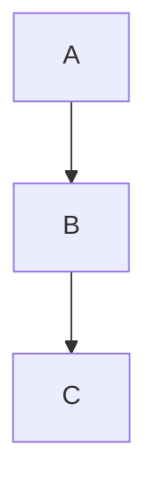

<!-- section:getting-started -->
# Getting Started

**VanFolio** is a distraction-free markdown editor for writers and developers.

## Create a new document

- Launch VanFolio — a blank **Untitled** tab opens automatically
- Start typing markdown immediately
- Save with **Ctrl+S** — you'll be prompted to choose a location the first time
- Save a copy to a different location with **Ctrl+Shift+S**

## Open an existing file

- **File → Open File** or **Ctrl+O**
- Drag a `.md` file directly into the editor window
- Recent files are listed in the **Files** panel (left sidebar)

## Tabs

- Click **+** to open a new empty tab
- Open multiple files simultaneously — each file gets its own tab
- Unsaved changes show a **●** dot on the tab
- Close a tab with **×** or middle-click

## Auto-save

Once a file has been saved to disk at least once, VanFolio auto-saves it automatically as you type.

## Session restore

When you relaunch VanFolio, your previous tabs and content are restored automatically — even unsaved Untitled documents.

---

<!-- section:writing-and-tabs -->
# Writing & Tabs

## Slash Commands

Type `/` anywhere in the editor to open the command palette.

| Command | Result |
|---|---|
| `/h1` `/h2` `/h3` | Headings |
| `/bullet` | Bullet list |
| `/numbered` | Numbered list |
| `/todo` | Todo checklist |
| `/codeblock` | Code block |
| `/table` | Markdown table |
| `/quote` | Blockquote |
| `/hr` | Horizontal rule |
| `/pagebreak` | Forced page break |
| `/link` | Insert link |
| `/image` | Insert image |
| `/mermaid` | Mermaid diagram block |
| `/code` | Inline code |
| `/katex` | KaTeX math block |

## Dirty state

A **●** dot on the tab means the file has unsaved changes. Auto-save clears this automatically when the file is on disk.

## Drag and drop

- Drag a `.md` file onto the editor window to open it in a new tab
- Drag an image file into the editor — VanFolio copies it to an `./assets/` folder next to your document and inserts the correct markdown image link automatically

---

<!-- section:markdown-and-media -->
# Markdown & Media

VanFolio renders **CommonMark** markdown with extras for tables, code highlighting, math, and diagrams.

## Text Formatting

| Syntax | Output |
|---|---|
| `**bold**` | **bold** |
| `*italic*` | *italic* |
| `` `code` `` | `code` |
| `~~strikethrough~~` | ~~strikethrough~~ |

## Headings

```
# Heading 1
## Heading 2
### Heading 3
```

## Lists

```
- Bullet item

1. Numbered item

- [ ] Todo item
- [x] Completed item
```

## Links & Images

```
[Link text](https://example.com)

```

## Code Blocks

````
```javascript
console.log("Hello VanFolio")
```
````

Supported languages: `javascript`, `typescript`, `python`, `bash`, `css`, `html`, `json`, and more.

## Tables

```
| Column A | Column B |
|---|---|
| Cell 1   | Cell 2   |
```

## Blockquote

```
> This is a blockquote
```

## Horizontal Rule

```
---
```

## Mermaid Diagrams

````

````

## KaTeX Math

Block math:

```
$$
E = mc^2
$$
```

Inline math: `$a^2 + b^2 = c^2$`

---

<!-- section:preview-and-layout -->
# Preview & Layout

## Live Preview

The right panel shows a live rendered preview of your markdown. It updates as you type.

The preview uses a **paginated print layout** — what you see closely reflects how the document will look when exported to PDF.

## Table of Contents

Press **Ctrl+\\** to toggle the TOC sidebar. Headings in your document appear as a navigation tree — click any heading to jump to that section in the preview.

## Detach Preview

Press **Ctrl+Alt+D** to open the preview in a separate window. Useful for dual-monitor setups.

## Focus Mode

Press **Ctrl+Shift+F** to enter Focus Mode — all panels are hidden, surrounding text is dimmed, and the UI fades to a minimal writing environment. Press **Escape** to exit.

## Typewriter Mode

Press **Ctrl+Shift+T** to keep the active line centered vertically as you type. Reduces eye travel on long documents.

## Fade Context

Press **Ctrl+Shift+D** to dim all lines except the paragraph you are currently editing.

---

<!-- section:export -->
# Export

Open the Export dialog from the **Export** menu. Press **Ctrl+E** to export directly as PDF.

## Formats

| Format | Notes |
|---|---|
| **PDF** | High-fidelity, uses Chromium renderer |
| **HTML** | Self-contained — images embedded as base64 |
| **DOCX** | Compatible with Microsoft Word 365 |
| **PNG** | Screenshot of the rendered preview, per page |

## PDF Options

- **Paper size** — A4, A3, or Letter
- **Orientation** — Portrait or Landscape
- **Include TOC** — Auto-generated table of contents at the start
- **Page numbers** — Footer page numbering
- **Watermark** — Optional text overlay

## HTML Options

- **Self-contained** — All images and styles embedded; single portable `.html` file

## DOCX Options

- Compatible with Microsoft Word 365
- Math (KaTeX) renders as plain text in DOCX

## PNG Options

- **Scale** — Resolution multiplier (1×, 2×)
- **Transparent background** — Export with transparent background instead of page white

---

<!-- section:collections-and-vault -->
# Collections & Vault

## Files Panel

The **Files** panel (left sidebar, first icon) shows your recently opened files. Click any file to reopen it.

## Folder Explorer

Use **File → Open Folder** or **Ctrl+Shift+O** to open a folder as a vault.

- Navigate the folder tree in the sidebar
- Click any `.md` file to open it in a new tab

## Vault

A vault is a folder you've opened in VanFolio. VanFolio remembers your last opened folder and reopens it automatically on the next launch.

## Onboarding

The first time you launch VanFolio, an onboarding flow helps you create or open a vault and get started with your first document.

## Discovery Mode

New to VanFolio? The **Discovery** panel (lightbulb icon in sidebar) walks you through key features interactively.

---

<!-- section:settings-and-typography -->
# Settings & Typography

Open Settings via the **⚙ gear icon** at the bottom of the left sidebar.

## Themes

| Theme | Style |
|---|---|
| **Van Ivory** | Warm parchment, editorial — light |
| **Dark Obsidian** | Deep dark, glass surfaces — high contrast |
| **Van Botanical** | Sage green, nature-inspired — light |
| **Van Chronicle** | Dark ink — minimal, focused |

## Language

Change the interface language under **General** settings. Supported: English, Tiếng Việt, 日本語, 한국어, Deutsch, 中文, Português (BR), Français, Русский, Español.

## Editor

- **Font size** — Editor text size in px
- **Line height** — Spacing between lines
- **Paragraph spacing** — Extra gap between paragraphs

## Typography

- **Font family** — Choose from built-in fonts or load a custom font file
- **Smart Quotes** — Automatically convert `"straight"` to `"curly"` quotes
- **Clean Prose** — Remove double spaces and tighten whitespace on export
- **Highlight Header** — Visually emphasize the document's H1 heading

## Compact Mode

Reduces padding throughout the UI for a denser layout. Useful on smaller screens.

---

<!-- section:archive-and-safety -->
# Archive & Safety

## Version History

VanFolio automatically saves snapshots of your document as you work.

Open **Version History** from the **File** menu to browse previous states of the current file. Click any snapshot to preview it, then restore it with one click.

## Retention

Configure how many snapshots to keep per file in **Settings → Archive & Safety**.

## Local Backup

VanFolio can write backup copies of your files to a separate folder on your disk.

Configure in **Settings → Archive & Safety**:

- **Backup folder** — Where backup files are saved
- **Run Backup Now** — Create a backup on demand
- **Manual only** — The public build does not run scheduled backups automatically
