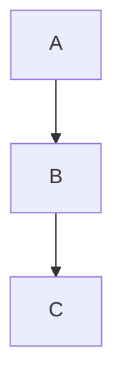

<!-- section:getting-started -->
# Primeros pasos

**VanFolio** es un editor de markdown sin distracciones para escritores y desarrolladores.

## Crear un nuevo documento

- Inicie VanFolio — una pestaña vacía **Untitled** (Sin título) se abre automáticamente.
- Empiece a escribir markdown inmediatamente.
- Guarde con **Ctrl+S** — se le pedirá elegir una ubicación la primera vez.
- Guarde una copia en una ubicación diferente con **Ctrl+Shift+S**.

## Abrir un archivo existente

- **Archivo → Abrir archivo** o **Ctrl+O**
- Arrastre un archivo `.md` directamente a la ventana del editor.
- Los archivos recientes se enumeran en el panel **Archivos** (barra lateral izquierda).

## Pestañas

- Haga clic en **+** para abrir una nueva pestaña vacía.
- Abra varios archivos simultáneamente — cada archivo tiene su propia pestaña.
- Los cambios no guardados muestran un punto **●** en la pestaña.
- Cierre una pestaña con la **×** o con el clic del botón central del ratón.

## Autoguardado

Una vez que un archivo se ha guardado en el disco al menos una vez, VanFolio guarda automáticamente mientras escribe.

## Restauración de sesión

Al reiniciar VanFolio, sus pestañas y contenidos anteriores se restauran automáticamente — incluso los documentos "Untitled" no guardados.

---

<!-- section:writing-and-tabs -->
# Escritura y pestañas

## Comandos de barra (Slash Commands)

Escriba `/` en cualquier lugar del editor para abrir la paleta de comandos.

| Comando | Resultado |
|---|---|
| `/h1` `/h2` `/h3` | Encabezados |
| `/bullet` | Lista con viñetas |
| `/numbered` | Lista numerada |
| `/todo` | Lista de tareas (Checklist) |
| `/codeblock` | Bloque de código |
| `/table` | Tabla Markdown |
| `/quote` | Cita (Blockquote) |
| `/hr` | Línea horizontal |
| `/pagebreak` | Salto de página forzado |
| `/link` | Insertar enlace |
| `/image` | Insertar imagen |
| `/mermaid` | Bloque de diagrama Mermaid |
| `/code` | Código en línea |
| `/katex` | Bloque de matemáticas KaTeX |

## Estado no guardado

Un punto **●** en la pestaña significa que el archivo tiene cambios sin guardar. El autoguardado limpia esto una vez que el archivo se actualiza en el disco.

## Arrastrar y soltar

- Arrastre un archivo `.md` a la ventana del editor para abrirlo en una nueva pestaña.
- Arrastre un archivo de imagen al editor — VanFolio lo copia en una carpeta `./assets/` junto a su documento e inserta automáticamente el enlace de imagen markdown correcto.

---

<!-- section:markdown-and-media -->
# Markdown y medios

VanFolio renderiza markdown estándar con extras para tablas, resaltado de código, matemáticas y diagramas.

## Formato de texto

| Sintaxis | Resultado |
|---|---|
| `**negrita**` | **negrita** |
| `*cursiva*` | *cursiva* |
| `` `código` `` | `código` |
| `~~tachado~~` | ~~tachado~~ |

## Encabezados

```
# Encabezado 1
## Encabezado 2
### Encabezado 3
```

## Listas

```
- Elemento de viñeta

1. Elemento numerado

- [ ] Tarea pendiente
- [x] Tarea completada
```

## Enlaces e imágenes

```
[Texto del enlace](https://example.com)

```

## Bloques de código

````
```javascript
console.log("Hola VanFolio")
```
````

Idiomas soportados: `javascript`, `typescript`, `python`, `bash`, `css`, `html`, `json` y más.

## Tablas

```
| Columna A | Coluna B |
|---|---|
| Celda 1   | Celda 2   |
```

## Cita (Blockquote)

```
> Esto es un bloque de cita
```

## Línea horizontal

```
---
```

## Diagramas Mermaid

````

````

## Matemáticas KaTeX

Matemáticas en bloque:

```
$$
E = mc^2
$$
```

Matemáticas en línea: `$a^2 + b^2 = c^2$`

---

<!-- section:preview-and-layout -->
# Vista previa y diseño

## Vista previa en vivo

El panel derecho muestra una vista previa renderizada en vivo de su markdown. Se actualiza mientras escribe.

La vista previa utiliza un **diseño de impresión paginado** — lo que ve refleja fielmente cómo se verá el documento al exportarlo a PDF.

## Tabla de contenidos (TOC)

Presione **Ctrl+\\** para alternar la barra lateral del índice. Los encabezados de su documento aparecen como un árbol de navegación — haga clic en cualquier encabezado para saltar a esa sección.

## Separar vista previa

Presione **Ctrl+Alt+D** para abrir la vista previa en una ventana separada. Útil para configuraciones de doble monitor.

## Modo Enfoque (Focus Mode)

Presione **Ctrl+Shift+F** para entrar en el Modo Enfoque — todos los paneles se ocultan, el texto circundante se atenúa y la interfaz se convierte en un entorno de escritura minimalista. Presione **Escape** para salir.

## Modo Máquina de escribir

Presione **Ctrl+Shift+T** para mantener la línea activa centrada verticalmente mientras escribe. Reduce el movimiento de los ojos en documentos largos.

## Atenuar contexto (Fade Context)

Presione **Ctrl+Shift+D** para atenuar todas las líneas excepto el párrafo que está editando actualmente.

---

<!-- section:export -->
# Exportar

Abra el diálogo de Exportación desde el menú **Exportar**, o presione **Ctrl+E** para exportar directamente como PDF.

## Formatos

| Formato | Notas |
|---|---|
| **PDF** | Alta fidelidad, utiliza el motor de renderizado Chromium |
| **HTML** | Autónomo — imágenes incrustadas como base64 |
| **DOCX** | Compatible con Microsoft Word 365 |
| **PNG** | Captura de pantalla de la vista previa renderizada, por página |

## Opciones de PDF

- **Tamaño de papel** — A4, A3 o Carta
- **Orientación** — Vertical (Portrait) o Horizontal (Landscape)
- **Incluir índice** — Índice generado automáticamente al inicio
- **Números de página** — Numeración en el pie de página
- **Marca de agua** — Superposición de texto opcional

## Opciones de HTML

- **Autónomo** — Todas las imágenes y estilos incrustados; un único archivo `.html` portátil.

## Opciones de DOCX

- Compatible con Word 365
- Las matemáticas (KaTeX) se renderizan como texto plano en DOCX.

## Opciones de PNG

- **Escala** — Multiplicador de resolución (1×, 2×)
- **Fondo transparente** — Exportar con fondo transparente en lugar del blanco de página.

---

<!-- section:collections-and-vault -->
# Colecciones y Vault

## Panel de archivos

El panel **Archivos** (barra lateral izquierda, primer icono) muestra sus archivos recientes. Haga clic en cualquier archivo para volver a abrirlo.

## Explorador de carpetas

Utilice **Archivo → Abrir carpeta** o **Ctrl+Shift+O** para abrir una carpeta como una "bóveda" (Vault).

- Navegue por el árbol de carpetas en la barra lateral.
- Haga clic en cualquier archivo `.md` para abrirlo en una nueva pestaña.

## Vault (Bóveda)

Un vault es una carpeta abierta en VanFolio. VanFolio recuerda la última carpeta abierta y la vuelve a abrir automáticamente en el próximo inicio.

## Bienvenida (Onboarding)

La primera vez que inicia VanFolio, un flujo de bienvenida le ayuda a crear o abrir una bóveda y comenzar con su primer documento.

## Modo Descubrimiento (Discovery Mode)

¿Nuevo en VanFolio? El panel Discovery (icono de bombilla) le guía a través de las funciones clave de forma interactiva.

---

<!-- section:settings-and-typography -->
# Ajustes y tipografía

Abra los Ajustes a través del **icono de engranaje ⚙** en la parte inferior de la barra lateral izquierda.

## Temas

| Tema | Estilo |
|---|---|
| **Van Ivory** | Pergamino cálido, editorial — claro |
| **Dark Obsidian** | Oscuro profundo, superficies de vidrio — alto contraste |
| **Van Botanical** | Verde salvia, inspirado en la naturaleza — claro |
| **Van Chronicle** | Tinta oscura — minimalista, enfocado |

## Idioma

Cambie el idioma de la interfaz en los ajustes **General**. Idiomas soportados: Inglés, Vietnamita, Japonés, Coreano, Alemán, Chino, Portugués (BR), Francés, Ruso, Español.

## Editor

- **Tamaño de fuente** — Tamaño del texto del editor en px.
- **Altura de línea** — Espacio entre líneas.
- **Espaciado de párrafo** — Espacio extra entre párrafos.

## Tipografía

- **Familia de fuentes** — Elija entre fuentes integradas o cargue archivos de fuentes personalizadas.
- **Smart Quotes** — Convierte automáticamente comillas rectas (`" "`) en comillas tipográficas.
- **Clean Prose** — Elimina espacios dobles y limpia los espacios en blanco al exportar.
- **Resaltado de Título** — Enfatiza visualmente el encabezado H1 del documento.

---

<!-- section:archive-and-safety -->
# Archivo y seguridad

## Historial de versiones

VanFolio guarda automáticamente capturas (snapshots) de sus documentos mientras trabaja.

Abra el **Historial de versiones** desde el menú **Archivo** para navegar por los estados anteriores del archivo. Haga clic en una captura para previsualizarla y restáurela con un solo clic.

## Retención

Puede configurar cuántas capturas mantener por archivo en **Ajustes → Archivo y seguridad**.

## Respaldo local

Además del historial de versiones, VanFolio puede guardar copias de respaldo de sus archivos en una carpeta separada en su disco.

Configúrelo en **Ajustes → Archivo y seguridad**:

- **Carpeta de respaldo** — Donde se guardan los archivos de respaldo.
- **Frecuencia de respaldo** — Intervalo entre respaldos (ej: cada 5 minutos).
- **Respaldo al exportar** — Crea automáticamente un respaldo siempre que exporte un archivo.
