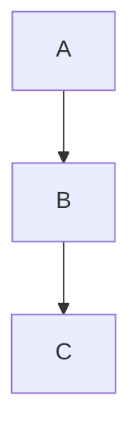

<!-- section:getting-started -->
# Démarrage

**VanFolio** est un éditeur markdown sans distractions pour les écrivains et les développeurs.

## Créer un nouveau document

- Lancez VanFolio — un onglet vide **Sans Titre (Untitled)** s'ouvre automatiquement.
- Commencez à taper du markdown immédiatement.
- Enregistrez avec **Ctrl+S** — vous devrez choisir un emplacement la première fois.
- Enregistrez une copie dans un autre emplacement avec **Ctrl+Shift+S**.

## Ouvrir un fichier existant

- **Fichier → Ouvrir Fichier** ou **Ctrl+O**
- Glissez un fichier `.md` directement dans la fenêtre de l'éditeur.
- Les fichiers récents sont listés dans le panneau **Fichiers** (barre latérale gauche).

## Onglets

- Cliquez sur le **+** pour ouvrir un nouvel onglet vide.
- Ouvrez plusieurs fichiers simultanément — chaque fichier a son propre onglet.
- Les modifications non enregistrées affichent un point **●** sur l'onglet.
- Fermez un onglet avec la **×** ou un clic du bouton central de la souris.

## Sauvegarde Automatique

Une fois qu'un fichier a été enregistré sur le disque au moins une fois, VanFolio enregistre automatiquement au fur et à mesure que vous tapez.

## Restauration de Session

Lorsque vous relancez VanFolio, vos onglets et contenus précédents sont restaurés automatiquement — même les documents "Sans Titre" non enregistrés.

---

<!-- section:writing-and-tabs -->
# Écriture & Onglets

## Commandes Slash (Slash Commands)

Tapez `/` n'importe où dans l'éditeur pour ouvrir la palette de commandes.

| Commande | Résultat |
|---|---|
| `/h1` `/h2` `/h3` | Titres (Headings) |
| `/bullet` | Liste à puces |
| `/numbered` | Liste numérotée |
| `/todo` | Liste de tâches (Checklist) |
| `/codeblock` | Bloc de code |
| `/table` | Tableau Markdown |
| `/quote` | Citation (Blockquote) |
| `/hr` | Ligne horizontale |
| `/pagebreak` | Saut de page forcé |
| `/link` | Insérer un lien |
| `/image` | Insérer une image |
| `/mermaid` | Bloc de diagramme Mermaid |
| `/code` | Code en ligne |
| `/katex` | Bloc de calcul mathématique KaTeX |

## État non enregistré

Un point **●** sur l'onglet signifie que le fichier contient des modifications non enregistrées. L'enregistrement automatique efface ce point une fois le fichier mis à jour sur le disque.

## Glisser-déposer

- Glissez un fichier `.md` sur la fenêtre de l'éditeur pour l'ouvrir dans un nouvel onglet.
- Glissez un fichier image dans l'éditeur — VanFolio le copie dans un dossier `./assets/` à côté de votre document et insère automatiquement le lien d'image markdown correct.

---

<!-- section:markdown-and-media -->
# Markdown & Médias

VanFolio rend le markdown standard avec des extensions pour les tableaux, la coloration syntaxique, les mathématiques et les diagrammes.

## Formatage du Texte

| Syntaxe | Résultat |
|---|---|
| `**gras**` | **gras** |
| `*italique*` | *italique* |
| `` `code` `` | `code` |
| `~~barré~~` | ~~barré~~ |

## Titres

```
# Titre 1
## Titre 2
### Titre 3
```

## Listes

```
- Élément à puce

1. Élément numéroté

- [ ] Élément à faire
- [x] Élément terminé
```

## Liens & Images

```
[Texte du lien](https://exemple.com)

```

## Blocs de Code

````
```javascript
console.log("Bonjour VanFolio")
```
````

Langages supportés : `javascript`, `typescript`, `python`, `bash`, `css`, `html`, `json` et bien d'autres.

## Tableaux

```
| Colonne A | Colonne B |
|---|---|
| Cellule 1 | Cellule 2 |
```

## Citation (Blockquote)

```
> Ceci est un bloc de citation
```

## Ligne Horizontale

```
---
```

## Diagrammes Mermaid

````

````

## Mathématiques KaTeX

Mathématiques en bloc :

```
$$
E = mc^2
$$
```

Mathématiques en ligne : `$a^2 + b^2 = c^2$`

---

<!-- section:preview-and-layout -->
# Aperçu & Mise en page

## Aperçu en Direct

Le panneau de droite affiche un aperçu rendu en direct de votre markdown. Il se met à jour au fur et à mesure que vous tapez.

L'aperçu utilise une **mise en page d'impression paginée** — ce que vous voyez reflète fidèlement l'aspect du document lors de l'exportation en PDF.

## Table des matières (TOC)

Appuyez sur **Ctrl+\\** pour activer ou désactiver la barre latérale du sommaire. Les titres de votre document apparaissent sous forme d'arbre de navigation — cliquez sur n'importe quel titre pour atteindre cette section.

## Détacher l'aperçu

Appuyez sur **Ctrl+Alt+D** pour ouvrir l'aperçu dans une fenêtre séparée. Utile pour les installations à double écran.

## Mode Focus

Appuyez sur **Ctrl+Shift+F** pour entrer en Mode Focus — tous les panneaux sont masqués, le texte environnant est assombri et l'interface devient un environnement d'écriture minimaliste. Appuyez sur **Escape** pour quitter.

## Mode Machine à écrire

Appuyez sur **Ctrl+Shift+T** pour garder la ligne active centrée verticalement pendant que vous tapez. Réduit le mouvement des yeux sur les longs documents.

## Estompage de Contexte (Fade Context)

Appuyez sur **Ctrl+Shift+D** pour assombrir toutes les lignes sauf le paragraphe que vous éditez actuellement.

---

<!-- section:export -->
# Exporter

Ouvrez la boîte de dialogue d'Exportation via le menu **Exporter**, ou appuyez sur **Ctrl+E** pour exporter directement en PDF.

## Formats

| Format | Notes |
|---|---|
| **PDF** | Haute fidélité, utilise le moteur de rendu Chromium |
| **HTML** | Autonome — images incorporées en base64 |
| **DOCX** | Compatible avec Microsoft Word 365 |
| **PNG** | Capture d'écran de l'aperçu rendu, par page |

## Options de PDF

- **Format de papier** — A4, A3 ou Lettre
- **Orientation** — Portrait ou Paysage (Landscape)
- **Inclure le sommaire** — Table des matières générée automatiquement au début
- **Numéros de page** — Pagination en pied de page
- **Filigrane** — Superposition de texte optionnelle

## Options de HTML

- **Autonome** — Toutes les images et tous les styles sont incorporés ; un seul fichier `.html` portable.

## Options de DOCX

- Compatible avec Word 365
- Les mathématiques (KaTeX) sont rendues sous forme de texte brut dans le DOCX.

## Options de PNG

- **Échelle** — Multiplicateur de résolution (1×, 2×)
- **Fond transparent** — Exporter avec un fond transparent au lieu du blanc des pages.

---

<!-- section:collections-and-vault -->
# Collections & Vault

## Panneau Fichiers

Le panneau **Fichiers** (barre latérale gauche, première icône) affiche vos fichiers récents. Cliquez sur n'importe quel fichier pour le rouvrir.

## Explorateur de dossiers

Utilisez **Fichier → Ouvrir Dossier** ou **Ctrl+Shift+O** pour ouvrir un dossier comme un "Coffre" (Vault).

- Naviguez dans l'arborescence des dossiers dans la barre latérale.
- Cliquez sur n'importe quel fichier `.md` pour l'ouvrir dans un nouvel onglet.

## Vault (Coffre)

Un vault est un dossier ouvert dans VanFolio. VanFolio se souvient du dernier dossier ouvert et le rouvre automatiquement au démarrage suivant.

## Intégration (Onboarding)

La première fois que vous lancez VanFolio, un flux d'intégration vous aide à créer ou ouvrir un coffre et à commencer votre premier document.

## Mode Découverte (Discovery Mode)

Nouveau sur VanFolio ? Le panneau Découverte (icône d'ampoule) vous présente les fonctionnalités clés de manière interactive.

---

<!-- section:settings-and-typography -->
# Paramètres & Typographie

Ouvrez les Paramètres via l'**icône d'engrenage ⚙** au bas de la barre latérale gauche.

## Thèmes

| Thème | Style |
|---|---|
| **Van Ivory** | Parchemin chaleureux, éditorial — clair |
| **Dark Obsidian** | Noir profond, surfaces en verre — contraste élevé |
| **Van Botanical** | Vert sauge, inspiré de la nature — clair |
| **Van Chronicle** | Encre noire — minimaliste, concentré |

## Langue

Changez la langue de l'interface dans les paramètres **Général**. Langues supportées : Anglais, Vietnamien, Japonais, Coréen, Allemand, Chinois, Portugais (BR), Français, Russe, Espagnol.

## Éditeur

- **Taille de police** — Taille du texte de l'éditeur en px.
- **Interligne** — Espace entre les lignes.
- **Espacement de paragraphe** — Espace supplémentaire entre les paragraphes.

## Typographie

- **Famille de polices** — Choisissez parmi les polices intégrées ou chargez une police personnalisée.
- **Smart Quotes** — Convertit automatiquement les guillemets droits (`" "`) en guillemets courbes.
- **Clean Prose** — Supprime les doubles espaces et nettoie les espaces blancs lors de l'exportation.
- **Mise en évidence du Titre** — Accentue visuellement le titre H1 du document.

---

<!-- section:archive-and-safety -->
# Archive & Sécurité

## Historique des Versions

VanFolio enregistre automatiquement des instantanés (snapshots) de vos documents au fur et à mesure que vous travaillez.

Ouvrez l'**Historique des Versions** depuis le menu **Fichier** pour naviguer dans les états antérieurs du fichier. Cliquez sur un instantané pour le visualiser et restaurez-le en un clic.

## Rétention

Vous pouvez configurer le nombre d'instantanés à conserver par fichier dans **Paramètres → Archive & Sécurité**.

## Sauvegarde Locale

En plus de l'historique des versions, VanFolio peut créer des copies de sauvegarde de vos fichiers dans un dossier séparé sur votre disque.

Configurez dans **Paramètres → Archive & Sécurité** :

- **Dossier de sauvegarde** — Où les fichiers de sauvegarde sont enregistrés.
- **Fréquence de sauvegarde** — Intervalle entre les sauvegardes (ex : toutes les 5 minutes).
- **Sauvegarde lors de l'exportation** — Crée automatiquement une sauvegarde chaque fois que vous exportez un fichier.
