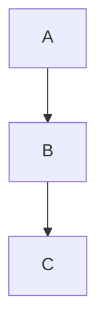

<!-- section:getting-started -->
# はじめに

**VanFolio**は、執筆者や開発者のための、集中力を妨げないマークダウンエディタです。

## 新規ドキュメントの作成

- VanFolioを起動すると、空の**Untitled**（無題）タブが自動的に開きます
- すぐにマークダウンの入力を開始できます
- **Ctrl+S**で保存します。初回保存時には保存場所の選択を求められます
- **Ctrl+Shift+S**で、別の場所にコピーを保存できます

## 既存のファイルを開く

- **ファイル → ファイルを開く**、または**Ctrl+O**
- `.md`ファイルをエディタウィンドウに直接ドラッグ＆ドロップ
- 最近使用したファイルは**Files**パネル（左サイドバー）に表示されます

## タブ

- **+**をクリックして、新しい空のタブを開きます
- 複数のファイルを同時に開くことができ、各ファイルに専用のタブが割り当てられます
- 未保存の変更があるタブには、**●**のドットが表示されます
- **×**をクリックするか、中クリックでタブを閉じます

## 自動保存

一度ファイルがディスクに保存されると、VanFolioは入力中に自動的に上書き保存を行います。

## セッションの復元

VanFolioを再起動すると、以前のタブと内容が自動的に復元されます。未保存のドキュメントも保持されます。

---

<!-- section:writing-and-tabs -->
# 執筆とタブ

## スラッシュコマンド

エディタの任意の場所で`/`を入力すると、コマンドパレットが開きます。

| コマンド | 結果 |
|---|---|
| `/h1` `/h2` `/h3` | 見出し |
| `/bullet` | 箇条書きリスト |
| `/numbered` | 番号付きリスト |
| `/todo` | ToDoチェックリスト |
| `/codeblock` | コードブロック |
| `/table` | マークダウンテーブル |
| `/quote` | 引用 |
| `/hr` | 水平線 |
| `/pagebreak` | 強制改ページ |
| `/link` | リンクの挿入 |
| `/image` | 画像の挿入 |
| `/mermaid` | Mermaidダイアグラム |
| `/code` | インラインコード |
| `/katex` | KaTeX数式ブロック |

## 未保存状態

タブに表示される**●**のドットは、ファイルに未保存の変更があることを示します。自動保存が実行されると、このドットは消えます。

## ドラッグ＆ドロップ

- `.md`ファイルをウィンドウにドラッグすると、新しいタブで開きます
- 画像ファイルをドラッグすると、VanFolioはドキュメントと同じ階層の`./assets/`フォルダに画像をコピーし、マークダウンの画像リンクを自動的に挿入します

---

<!-- section:markdown-and-media -->
# Markdownとメディア

VanFolioは標準的なマークダウンに加え、テーブル、コードハイライト、数式、ダイアグラムなどをサポートしています。

## テキスト装飾

| 構文 | 出力 |
|---|---|
| `**太字**` | **太字** |
| `*斜体*` | *斜体* |
| `` `コード` `` | `コード` |
| `~~打消線~~` | ~~打消線~~ |

## 見出し

```
# 見出し 1
## 見出し 2
### 見出し 3
```

## リスト

```
- 箇条書き項目

1. 番号付き項目

- [ ] 未完了のToDo
- [x] 完了したToDo
```

## リンクと画像

```
[リンクテキスト](https://example.com)

```

## コードブロック

````
```javascript
console.log("Hello VanFolio")
```
````

対応言語: `javascript`, `typescript`, `python`, `bash`, `css`, `html`, `json` など多数。

## テーブル

```
| 列 A | 列 B |
|---|---|
| セル 1 | セル 2 |
```

## 引用

```
> これは引用文です
```

## 水平線

```
---
```

## Mermaidダイアグラム

````

````

## KaTeX数式

ブロック数式:

```
$$
E = mc^2
$$
```

インライン数式: `$a^2 + b^2 = c^2$`

---

<!-- section:preview-and-layout -->
# プレビューとレイアウト

## ライブプレビュー

右側のパネルには、マークダウンのレンダリング結果がリアルタイムで表示されます。入力に合わせて更新されます。

プレビューは**ページ分割された印刷レイアウト**を採用しており、PDF書き出し時の外観を正確に確認できます。

## 目次 (TOC)

**Ctrl+\\**キーで、目次サイドバーを切り替えます。ドキュメントの見出しがナビゲーションツリーとして表示され、クリックで見出し位置へジャンプできます。

## プレビューの分離

**Ctrl+Alt+D**キーを押すと、プレビューを別ウィンドウで開くことができます。マルチモニター環境での執筆に最適です。

## フォーカスモード

**Ctrl+Shift+F**キーでフォーカスモードに入ります。すべてのパネルが非表示になり、周囲のテキストが暗くなります。最小限の執筆環境を提供します。**Escape**キーで終了します。

## タイプライターモード

**Ctrl+Shift+T**キーで、入力中の行を常に垂直方向の中央に保持します。長い文書を書く際の視線移動を減らせます。

## コンテキストフェード

**Ctrl+Shift+D**キーで、現在編集中の段落以外の行を暗く表示します。

---

<!-- section:export -->
# エクスポート

**Export**メニューからエクスポートダイアログを開きます。**Ctrl+E**キーで直接PDFとして書き出せます。

## 出力形式

| 形式 | 備考 |
|---|---|
| **PDF** | 高精度な出力。Chromiumレンダラーを使用 |
| **HTML** | 単一ファイル形式。画像はbase64で埋め込まれます |
| **DOCX** | Microsoft Word 365と互換性あり |
| **PNG** | 各ページを画像として保存 |

## PDF オプション

- **用紙サイズ** — A4, A3, Letter
- **方向** — 縦 (Portrait) または 横 (Landscape)
- **目次を含める** — 文頭に自動生成された目次を追加
- **ページ番号** — フッターにページ番号を表示
- **透かし (Watermark)** — 任意のテキストをオーバーレイ表示

## HTML オプション

- **自己完結型** — すべての画像とスタイルを埋め込み、単一の`.html`として出力

## DOCX オプション

- Microsoft Word 365互換
- 数式 (KaTeX) はプレーンテキストとして出力されます

## PNG オプション

- **スケール** — 解像度倍率 (1倍, 2倍)
- **背景を透過** — 背景色を白ではなく透明にして書き出し

---

<!-- section:collections-and-vault -->
# コレクションとVault

## Filesパネル

**Files**パネル（左サイドバーの最初のアイコン）には最近開いたファイルが表示されます。クリックで再開できます。

## フォルダエクスプローラー

**ファイル → フォルダを開く**、または**Ctrl+Shift+O**でフォルダをVaultとして開きます。

- サイドバーのフォルダツリーをナビゲート
- `.md`ファイルをクリックして新しいタブで開く

## Vault (ヴォルト)

Vaultとは、VanFolioで開いたフォルダのことです。VanFolioは最後に開いたフォルダを記憶し、次回起動時に自動的に再開します。

## オンボーディング

VanFolioを初めて起動すると、Vaultの作成や既存フォルダの読み込みを案内するフローが表示されます。

## ディスカバリーモード

VanFolioの使い方をもっと知りたい場合は、サイドバーの電球アイコン（**Discovery**パネル）で主要機能をインタラクティブに学習できます。

---

<!-- section:settings-and-typography -->
# 設定とタイポグラフィ

左サイドバー下部の**⚙️ギアアイコン**から設定を開きます。

## テーマ

| テーマ | スタイル |
|---|---|
| **Van Ivory** | 温かみのある羊皮紙風。ライトテーマ |
| **Dark Obsidian** | 深い黒とガラスの質感。高コントラスト |
| **Van Botanical** | セージグリーン、自然モチーフ。ライトテーマ |
| **Van Chronicle** | 深いインク。ミニマルで集中力を高めるダークテーマ |

## 言語 (Language)

**General**設定でインターフェースの言語を変更できます。対応言語: 英語、ベトナム語、日本語、韓国語、ドイツ語、中国語、ポルトガル語、フランス語、ロシア語、スペイン語。

## エディタ

- **フォントサイズ** — px単位で指定
- **行の高さ** — 行間の調整
- **段落の間隔** — 段落後の余白

## タイポグラフィ

- **フォントファミリー** — 内蔵フォントまたはカスタムフォントファイルの使用
- **スマートクオート** — 直線の引用符を自動的に曲線の引用符に変換
- **Clean Prose** — 書き出し時に二重スペースを削除し、空白を整理
- **ヘッダー強調** — 文頭のH1見出しを視覚的に強調

---

<!-- section:archive-and-safety -->
# アーカイブと安全性

## バージョン履歴

VanFolioは、作業中にドキュメントのスナップショットを自動的に保存します。

**ファイル**メニューから**Version History**を開き、ファイルの過去の状態を確認できます。スナップショットをクリックして内容をプレビューし、ワンクリックで復元できます。

## 保持設定

各ファイルに対して保存するスナップショットの数は、**設定 → アーカイブと安全性**で変更可能です。

## ローカルバックアップ

バージョン履歴に加え、ファイルをディスク上の別のフォルダにバックアップコピーとして保存できます。

**設定 → アーカイブと安全性**で以下の設定が可能です：

- **バックアップフォルダ** — 保存先の指定
- **頻度** — 書き込み間隔（例：5分ごと）
- **エクスポート時にバックアップ** — 書き出し時に自動でバックアップを作成
