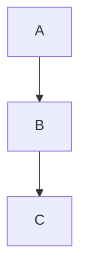

<!-- section:getting-started -->
# 시작하기

**VanFolio**는 작가와 개발자를 위한 집중력이 흐트러지지 않는 마크다운 에디터입니다.

## 새 문서 만들기

- VanFolio를 실행하면 빈 **Untitled**(제목 없음) 탭이 자동으로 열립니다.
- 즉시 마크다운을 입력하기 시작할 수 있습니다.
- **Ctrl+S**로 저장하세요. 처음 저장할 때는 위치를 선택하라는 메시지가 표시됩니다.
- **Ctrl+Shift+S**로 다른 위치에 사본을 저장할 수 있습니다.

## 기존 파일 열기

- **파일 → 파일 열기** 또는 **Ctrl+O**
- `.md` 파일을 에디터 창으로 직접 드래그 앤 드롭하세요.
- 최근 파일은 **가장 왼쪽 사이드바**의 **Files** 패널에 나열됩니다.

## 탭

- **+**를 클릭하여 새로운 빈 탭을 엽니다.
- 여러 파일을 동시에 열 수 있으며, 각 파일은 고유한 탭을 가집니다.
- 저장되지 않은 변경 사항이 있는 탭에는 **●** 점이 표시됩니다.
- **×** 또는 마우스 휠 클릭으로 탭을 닫습니다.

## 자동 저장

파일이 디스크에 한 번 이상 저장되면, VanFolio는 입력할 때마다 자동으로 내용을 저장합니다.

## 세션 복구

VanFolio를 다시 실행하면 이전 탭과 내용이 자동으로 복구됩니다. 저장되지 않은 Untitled 문서도 유지됩니다.

---

<!-- section:writing-and-tabs -->
# 작성 및 탭

## 슬래시 명령

에디터 어디에서나 `/`를 입력하여 명령 팔레트를 엽니다.

| 명령 | 결과 |
|---|---|
| `/h1` `/h2` `/h3` | 제목 (Headings) |
| `/bullet` | 글머리 기호 목록 |
| `/numbered` | 번호 매기기 목록 |
| `/todo` | 할 일 체크리스트 |
| `/codeblock` | 코드 블록 |
| `/table` | 마크다운 표 |
| `/quote` | 인용구 |
| `/hr` | 가로 구분선 |
| `/pagebreak` | 강제 페이지 나누기 |
| `/link` | 링크 삽입 |
| `/image` | 이미지 삽입 |
| `/mermaid` | Mermaid 다이어그램 블록 |
| `/code` | 인라인 코드 |
| `/katex` | KaTeX 수학 수식 블록 |

## 저장되지 않은 상태

탭에 표시되는 **●** 점은 파일에 저장되지 않은 변경 사항이 있음을 의미합니다. 자동 저장이 실행되면 이 점은 자동으로 사라집니다.

## 드래그 앤 드롭

- `.md` 파일을 에디터 창에 드래그하면 새 탭에서 열립니다.
- 이미지 파일을 드래그하면, VanFolio는 해당 이미지를 현재 문서 옆의 `./assets/` 폴더로 복사하고 마크다운 이미지 링크를 자동으로 삽입합니다.

---

<!-- section:markdown-and-media -->
# Markdown 및 미디어

VanFolio는 표준적인 마크다운에 표, 코드 강조, 수학 수식, 다이어그램 등의 기능을 추가로 지원합니다.

## 텍스트 서식

| 구문 | 결과 |
|---|---|
| `**굵게**` | **굵게** |
| `*기울임*` | *기울임* |
| `` `코드` `` | `코드` |
| `~~취소선~~` | ~~취소선~~ |

## 제목

```
# 제목 1
## 제목 2
### 제목 3
```

## 목록

```
- 글머리 기호 항목

1. 번호 매기기 항목

- [ ] 할 일 항목
- [x] 완료된 항목
```

## 링크 및 이미지

```
[링크 텍스트](https://example.com)

```

## 코드 블록

````
```javascript
console.log("Hello VanFolio")
```
````

지원되는 언어: `javascript`, `typescript`, `python`, `bash`, `css`, `html`, `json` 등 다수.

## 표

```
| 열 A | 열 B |
|---|---|
| 셀 1 | 셀 2 |
```

## 인용구

```
> 이것은 인용구입니다.
```

## 가로 구분선

```
---
```

## Mermaid 다이어그램

````

````

## KaTeX 수학 수식

블록 수식:

```
$$
E = mc^2
$$
```

인라인 수식: `$a^2 + b^2 = c^2$`

---

<!-- section:preview-and-layout -->
# 미리보기 및 레이아웃

## 실시간 미리보기

오른쪽 패널에는 마크다운이 렌더링된 미리보기가 실시간으로 표시됩니다. 입력하는 즉시 업데이트됩니다.

미리보기는 **페이지 단위 인쇄 레이아웃**을 사용합니다. 화면에서 보는 모습이 PDF로 내보낼 때의 결과물과 매우 유사합니다.

## 목차 (TOC)

**Ctrl+\\**를 눌러 목차 사이드바를 켜거나 끕니다. 문서의 제목이 탐색 리스트로 표시되며, 클릭하면 해당 섹션으로 즉시 이동합니다.

## 미리보기 분리

**Ctrl+Alt+D**를 눌러 미리보기를 별도의 창으로 엽니다. 듀얼 모니터 환경에서 유용합니다.

## 포커스 모드

**Ctrl+Shift+F**를 눌러 포커스 모드(Focus Mode)로 진입합니다. 모든 패널이 숨겨지고 현재 작성 중인 텍스트 이외의 영역이 어두워집니다. **Escape** 키를 눌러 종료합니다.

## 타자기 모드

**Ctrl+Shift+T**를 누르면 입력 중인 줄이 항상 화면의 수직 중앙에 유지됩니다. 긴 문서를 작성할 때 시선의 이동을 줄여줍니다.

## 컨텍스트 페이드

**Ctrl+Shift+D**를 누르면 현재 편집 중인 단락을 제외한 나머지 줄이 흐릿하게 표시됩니다.

---

<!-- section:export -->
# 내보내기

**Export** 메뉴에서 내보내기 대화창을 열거나, **Ctrl+E**를 눌러 즉시 PDF로 내보낼 수 있습니다.

## 지원 형식

| 형식 | 참고 |
|---|---|
| **PDF** | 고품질 출력. Chromium 렌더러 사용 |
| **HTML** | 단일 파일 형식. 이미지가 base64로 포함됨 |
| **DOCX** | Microsoft Word 365와 호환 |
| **PNG** | 렌더링된 미리보기를 페이지별로 캡처하여 저장 |

## PDF 옵션

- **용지 크기** — A4, A3, Letter
- **방향** — 세로 (Portrait) 또는 가로 (Landscape)
- **목차 포함** — 문서 시작 부분에 목차 자동 생성
- **페이지 번호** — 하단 페이지 번호 표시
- **워터마크** — 선택적 텍스트 오버레이

## HTML 옵션

- **자체 포함형** — 모든 이미지와 스타일이 포함된 하나의 독립적인 `.html` 파일

## DOCX 옵션

- Microsoft Word 365와 호환
- 수학 수식(KaTeX)은 DOCX에서 일반 텍스트로 렌더링됩니다.

## PNG 옵션

- **배율** — 해상도 배수 (1×, 2×)
- **투명 배경** — 배경을 흰색이 아닌 투명하게 내보내기

---

<!-- section:collections-and-vault -->
# Collections & Vault

## Files 패널

**Files** 패널(왼쪽 사이드바의 첫 번째 아이콘)은 최근 파일을 보여줍니다. 클릭하여 다시 엽니다.

## 폴더 탐색기

**파일 → 폴더 열기** 또는 **Ctrl+Shift+O**를 사용하여 폴더를 보관소(Vault)로 엽니다.

- 왼쪽의 폴더 트리를 탐색합니다.
- `.md` 파일을 클릭하여 새 탭에서 엽니다.

## Vault (보관소)

보관소는 VanFolio에서 열린 폴더를 의미합니다. VanFolio는 마지막으로 연 폴더를 기억하여 다음 실행 시 자동으로 다시 엽니다.

## 온보딩

VanFolio를 처음 실행하면 첫 문서를 시작할 수 있도록 보관소를 생성하거나 여는 과정을 안내합니다.

## 발견 모드 (Discovery Mode)

전구 아이콘을 클릭하여 인터랙티브한 안내를 통해 주요 기능을 익힐 수 있습니다.

---

<!-- section:settings-and-typography -->
# 설정 및 타이포그래피

왼쪽 사이드바 하단의 **⚙ 톱니바퀴 아이콘**을 통해 설정을 엽니다.

## 테마

| 테마 | 스타일 |
|---|---|
| **Van Ivory** | 따뜻한 양피지 느낌. 라이트 테마 |
| **Dark Obsidian** | 깊은 검은색과 유리 질감. 고대비 테마 |
| **Van Botanical** | 세이지 그린, 자연 테마. 라이트 테마 |
| **Van Chronicle** | 깊은 잉크 느낌. 미니멀한 다크 테마 |

## 언어

**General** 설정에서 언어를 변경할 수 있습니다. 지원 언어: 영어, 베트남어, 일본어, 한국어, 독일어, 중국어, 포르투갈어, 프랑스어, 러시아어, 스페인어.

## 에디터 설정

- **글꼴 크기** — 에디터 텍스트 크기 (px)
- **줄 간격** — 텍스트 줄 사이의 간격
- **단락 간격** — 단락 사이의 여백

## 타이포그래피

- **글꼴** — 내장 글꼴 선택 또는 사용자 지정 글꼴 파일 불러오기
- **스마트 따옴표** — 곧은 따옴표(`" "`)를 둥근 따옴표로 자동 변환
- **Clean Prose** — 내보낼 때 이중 공백을 제거하고 공백을 정리
- **제목 강조** — 문서의 H1 제목을 시각적으로 강조

---

<!-- section:archive-and-safety -->
# 아카이브 및 안전

## 버전 기록

VanFolio는 작업 중인 문서의 스냅샷을 자동으로 저장합니다.

**파일** 메뉴에서 **Version History**를 열어 이전 상태를 확인하세요. 스냅샷을 클릭하여 미리보고 한 번의 클릭으로 복원할 수 있습니다.

## 유지 기간

**설정 → 아카이브 및 안전**에서 파일당 보관할 스냅샷 개수를 설정할 수 있습니다.

## 로컬 백업

버전 기록 외에도 파일을 별도의 폴더에 백업 사본으로 저장할 수 있습니다.

**설정 → 아카이브 및 안전**에서 구성:

- **백업 폴더** — 백업 파일 저장 위치
- **백업 빈도** — 백업 생성 간격 (예: 5분마다)
- **내보낼 때 백업** — 파일을 내보낼 때마다 자동으로 백업 생성
