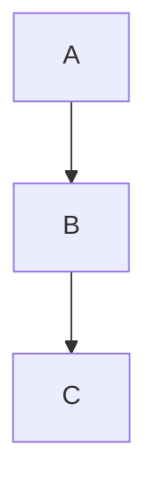

<!-- section:getting-started -->
# Primeiros Passos

**VanFolio** é um editor de markdown sem distrações para escritores e desenvolvedores.

## Criar um novo documento

- Inicie o VanFolio — uma aba vazia **Sem Título (Untitled)** abre automaticamente.
- Comece a digitar markdown imediatamente.
- Salve com **Ctrl+S** — você será solicitado a escolher um local na primeira vez.
- Salve uma cópia em um local diferente com **Ctrl+Shift+S**.

## Abrir um arquivo existente

- **Arquivo → Abrir Arquivo** ou **Ctrl+O**
- Arraste um arquivo `.md` diretamente para a janela do editor.
- Arquivos recentes são listados no painel **Arquivos** (barra lateral esquerda).

## Abas

- Clique no **+** para abrir uma nova aba vazia.
- Abra vários arquivos simultaneamente — cada arquivo recebe sua própria aba.
- Alterações não salvas mostram um ponto **●** na aba.
- Feche uma aba com o **×** ou clique com o botão do meio do mouse.

## Salvamento Automático

Depois que um arquivo foi salvo no disco pelo menos uma vez, o VanFolio salva automaticamente enquanto você digita.

## Restauração de Sessão

Ao reiniciar o VanFolio, suas abas e conteúdos anteriores são restaurados automaticamente — mesmo documentos "Sem Título" não salvos.

---

<!-- section:writing-and-tabs -->
# Escrita & Abas

## Comandos de Barra (Slash Commands)

Digite `/` em qualquer lugar do editor para abrir a paleta de comandos.

| Comando | Resultado |
|---|---|
| `/h1` `/h2` `/h3` | Cabeçalhos |
| `/bullet` | Lista com marcadores |
| `/numbered` | Lista numerada |
| `/todo` | Lista de tarefas (Checklist) |
| `/codeblock` | Bloco de código |
| `/table` | Tabela Markdown |
| `/quote` | Citação (Blockquote) |
| `/hr` | Linha horizontal |
| `/pagebreak` | Quebra de página forçada |
| `/link` | Inserir link |
| `/image` | Inserir imagem |
| `/mermaid` | Bloco de diagrama Mermaid |
| `/code` | Código inline |
| `/katex` | Bloco de matemática KaTeX |

## Estado não salvo (Dirty state)

Um ponto **●** na aba significa que o arquivo tem alterações não salvas. O salvamento automático limpa isso quando o arquivo é atualizado no disco.

## Arrastar e soltar

- Arraste um arquivo `.md` para a janela do editor para abri-lo em uma nova aba.
- Arraste um arquivo de imagem para o editor — o VanFolio copia para uma pasta `./assets/` ao lado do seu documento e insere o link de imagem markdown correto automaticamente.

---

<!-- section:markdown-and-media -->
# Markdown & Mídia

O VanFolio renderiza markdown padrão com extras para tabelas, realce de código, matemática e diagramas.

## Formatação de Texto

| Sintaxe | Resultado |
|---|---|
| `**negrito**` | **negrito** |
| `*itálico*` | *itálico* |
| `` `código` `` | `código` |
| `~~tachado~~` | ~~tachado~~ |

## Cabeçalhos

```
# Cabeçalho 1
## Cabeçalho 2
### Cabeçalho 3
```

## Listas

```
- Item com marcador

1. Item numerado

- [ ] Item pendente
- [x] Item concluído
```

## Links & Imagens

```
[Texto do link](https://exemplo.com)

```

## Blocos de Código

````
```javascript
console.log("Olá VanFolio")
```
````

Idiomas suportados: `javascript`, `typescript`, `python`, `bash`, `css`, `html`, `json` e outros.

## Tabelas

```
| Coluna A | Coluna B |
|---|---|
| Célula 1 | Célula 2 |
```

## Citação (Blockquote)

```
> Isso é um bloco de citação
```

## Linha Horizontal

```
---
```

## Diagramas Mermaid

````

````

## Matemática KaTeX

Matemática em bloco:

```
$$
E = mc^2
$$
```

Matemática inline: `$a^2 + b^2 = c^2$`

---

<!-- section:preview-and-layout -->
# Prévia & Layout

## Prévia ao Vivo

O painel direito mostra uma prévia renderizada ao vivo do seu markdown. Ele atualiza conforme você digita.

A prévia usa um **layout de impressão paginado** — o que você vê reflete de perto como o documento ficará ao ser exportado para PDF.

## Sumário (TOC)

Pressione **Ctrl+\\** para alternar a barra lateral do sumário. Os cabeçalhos do seu documento aparecem como uma árvore de navegação — clique em qualquer cabeçalho para pular para essa seção.

## Destacar Prévia

Pressione **Ctrl+Alt+D** para abrir a prévia em uma janela separada. Útil para configurações de dois monitores.

## Modo Foco (Focus Mode)

Pressione **Ctrl+Shift+F** para entrar no Modo Foco — todos os painéis são ocultados, o texto ao redor é esmaecido e a interface se torna um ambiente de escrita minimalista. Pressione **Escape** para sair.

## Modo Máquina de Escrever

Pressione **Ctrl+Shift+T** para manter a linha ativa centralizada verticalmente enquanto você digita. Reduz o movimento dos olhos em documentos longos.

## Esmaecer Contexto

Pressione **Ctrl+Shift+D** para esmaecer todas as linhas, exceto o parágrafo que você está editando no momento.

---

<!-- section:export -->
# Exportar

Abra o diálogo de Exportação pelo menu **Exportar**, ou pressione **Ctrl+E** para exportar como PDF diretamente.

## Formatos

| Formato | Notas |
|---|---|
| **PDF** | Alta fidelidade, usa renderizador Chromium |
| **HTML** | Independente — imagens incorporadas como base64 |
| **DOCX** | Compatível com Microsoft Word 365 |
| **PNG** | Captura da prévia renderizada, por página |

## Opções de PDF

- **Tamanho do papel** — A4, A3 ou Carta
- **Orientação** — Retrato (Portrait) ou Paisagem (Landscape)
- **Incluir Sumário** — Sumário gerado automaticamente no início
- **Números de página** — Numeração no rodapé
- **Marca d'água** — Sobreposição de texto opcional

## Opções de HTML

- **Independente** — Todas as imagens e estilos incorporados; um único arquivo `.html` portátil.

## Opções de DOCX

- Compatível com Word 365
- Matemática (KaTeX) é renderizada como texto simples no DOCX.

## Opções de PNG

- **Escala** — Multiplicador de resolução (1×, 2×)
- **Fundo transparente** — Exportar com fundo transparente em vez de branco.

---

<!-- section:collections-and-vault -->
# Coleções & Vault

## Painel de Arquivos

O painel **Arquivos** (barra lateral esquerda, primeiro ícone) mostra seus arquivos recentes. Clique em qualquer arquivo para reabri-lo.

## Explorador de Pastas

Use **Arquivo → Abrir Pasta** ou **Ctrl+Shift+O** para abrir uma pasta como um "vault" (cofre/biblioteca).

- Navegue pela árvore de pastas na barra lateral.
- Clique em qualquer arquivo `.md` para abrir em uma nova aba.

## Vault (Cofre)

Um vault é uma pasta aberta no VanFolio. O VanFolio lembra da última pasta aberta e reabre automaticamente na próxima inicialização.

## Integração (Onboarding)

Na primeira vez que você inicia o VanFolio, um fluxo de integração ajuda a criar ou abrir um vault e começar seu primeiro documento.

## Modo Descoberta (Discovery Mode)

Novo no VanFolio? O painel Discovery (ícone de lâmpada) apresenta as principais funcionalidades de forma interativa.

---

<!-- section:settings-and-typography -->
# Configurações & Tipografia

Abra as Configurações pelo **ícone de engrenagem ⚙** na parte inferior da barra lateral esquerda.

## Temas

| Tema | Estilo |
|---|---|
| **Van Ivory** | Pergaminho quente, editorial — claro |
| **Dark Obsidian** | Escuro profundo, superfícies de vidro — alto contraste |
| **Van Botanical** | Verde sálvia, inspirado na natureza — claro |
| **Van Chronicle** | Tinta escura — minimalista, focado |

## Idioma

Altere o idioma da interface nas configurações **Gerais**. Idiomas suportados: Inglês, Vietnamita, Japonês, Coreano, Alemão, Chinês, Português (BR), Francês, Russo, Espanhol.

## Editor

- **Tamanho da fonte** — Tamanho do texto do editor em px.
- **Altura da linha** — Espaço entre as linhas.
- **Espaçamento de parágrafo** — Espaço extra entre os parágrafos.

## Tipografia

- **Família de fontes** — Escolha entre fontes integradas ou carregue fontes personalizadas.
- **Smart Quotes** — Converte aspas retas (`" "`) em aspas curvas automaticamente.
- **Clean Prose** — Remove espaços duplos e organiza o espaço em branco na exportação.
- **Destaque de Cabeçalho** — Enfatiza visualmente o cabeçalho H1 do documento.

---

<!-- section:archive-and-safety -->
# Arquivo & Segurança

## Histórico de Versões

O VanFolio salva snapshots (capturas) dos seus documentos automaticamente enquanto você trabalha.

Abra o **Histórico de Versões** pelo menu **Arquivo** para navegar pelos estados anteriores do arquivo. Clique em um snapshot para pré-visualizar e restaure com um clique.

## Retenção

Você pode configurar quantos snapshots manter por arquivo em **Configurações → Arquivo & Segurança**.

## Backup Local

Além do histórico de versões, o VanFolio pode salvar cópias de backup em uma pasta separada no disco.

Configure em **Configurações → Arquivo & Segurança**:

- **Pasta de backup** — Onde os arquivos são salvos.
- **Frequência de backup** — Intervalo entre backups (ex: a cada 5 minutos).
- **Backup ao exportar** — Cria um backup automaticamente sempre que exportar um arquivo.
