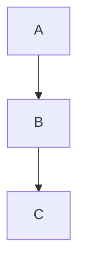

<!-- section:getting-started -->
# Начало работы

**VanFolio** — это минималистичный Markdown-редактор для писателей и разработчиков, не отвлекающий от процесса.

## Создание нового документа

- Запустите VanFolio — автоматически откроется пустая вкладка **Untitled** (Без названия).
- Сразу приступайте к написанию текста в формате Markdown.
- Сохраните файл с помощью **Ctrl+S** — при первом сохранении вам будет предложено выбрать место на диске.
- Сохраните копию в другом месте с помощью **Ctrl+Shift+S**.

## Открытие существующего файла

- **Файл → Открыть файл** или **Ctrl+O**
- Перетащите `.md` файл прямо в окно редактора.
- Последние открытые файлы отображаются на панели **Файлы** (левая боковая панель).

## Вкладки

- Нажмите **+**, чтобы открыть новую пустую вкладку.
- Открывайте несколько файлов одновременно — каждый файл получит свою вкладку.
- Несохраненные изменения помечаются точкой **●** на вкладке.
- Закройте вкладку, нажав на **×** или среднюю кнопку мыши.

## Автосохранение

Как только файл был сохранен на диск хотя бы один раз, VanFolio начинает автоматически сохранять его по мере ввода текста.

## Восстановление сессии

При перезапуске VanFolio ваши предыдущие вкладки и содержимое восстанавливаются автоматически — даже несохраненные документы "Untitled".

---

<!-- section:writing-and-tabs -->
# Написание и вкладки

## Слэш-команды (Slash Commands)

Введите `/` в любом месте редактора, чтобы открыть палитру команд.

| Команда | Результат |
|---|---|
| `/h1` `/h2` `/h3` | Заголовки |
| `/bullet` | Маркированный список |
| `/numbered` | Нумерованный список |
| `/todo` | Список задач (Checklist) |
| `/codeblock` | Блок кода |
| `/table` | Markdown-таблица |
| `/quote` | Цитата (Blockquote) |
| `/hr` | Горизонтальная черта |
| `/pagebreak` | Принудительный разрыв страницы |
| `/link` | Вставить ссылку |
| `/image` | Вставить изображение |
| `/mermaid` | Блок диаграммы Mermaid |
| `/code` | Встроенный код |
| `/katex` | Блок математики KaTeX |

## Состояние несохраненности

Точка **●** на вкладке означает наличие несохраненных изменений. Автосохранение убирает эту пометку, как только файл обновляется на диске.

## Перетаскивание (Drag and drop)

- Перетащите `.md` файл в окно редактора, чтобы открыть его в новой вкладке.
- Перетащите файл изображения в редактор — VanFolio скопирует его в папку `./assets/` рядом с вашим документом и автоматически вставит правильную Markdown-ссылку на изображение.

---

<!-- section:markdown-and-media -->
# Markdown и медиа

VanFolio поддерживает стандартный Markdown с дополнениями для таблиц, подсветки кода, математики и диаграмм.

## Форматирование текста

| Синтаксис | Результат |
|---|---|
| `**жирный**` | **жирный** |
| `*курсив*` | *курсив* |
| `` `код` `` | `код` |
| `~~зачеркнутый~~` | ~~зачеркнутый~~ |

## Заголовки

```
# Заголовок 1
## Заголовок 2
### Заголовок 3
```

## Списки

```
- Маркированный пункт

1. Нумерованный пункт

- [ ] Задача
- [x] Выполнено
```

## Ссылки и изображения

```
[Текст ссылки](https://example.com)

```

## Блоки кода

````
```javascript
console.log("Привет, VanFolio")
```
````

Поддерживаемые языки: `javascript`, `typescript`, `python`, `bash`, `css`, `html`, `json` и многие другие.

## Таблицы

```
| Столбец A | Столбец B |
|---|---|
| Ячейка 1  | Ячейка 2  |
```

## Цитата (Blockquote)

```
> Это блок цитаты
```

## Горизонтальная черта

```
---
```

## Диаграммы Mermaid

````

````

## Математика KaTeX

Блочная математика:

```
$$
E = mc^2
$$
```

Инлайновая математика: `$a^2 + b^2 = c^2$`

---

<!-- section:preview-and-layout -->
# Предпросмотр и макет

## Живой предпросмотр

Правая панель отображает отрендеренный текст в реальном времени. Обновляется по мере ввода.

Предпросмотр использует **постраничный макет для печати** — то, что вы видите, максимально соответствует виду документа при экспорте в PDF.

## Оглавление (TOC)

Нажмите **Ctrl+\\**, чтобы открыть или скрыть боковую панель оглавления. Заголовки вашего документа отображаются в виде навигационного дерева — нажмите на любой заголовок, чтобы перейти к нему.

## Отделение окна предпросмотра

Нажмите **Ctrl+Alt+D**, чтобы открыть предпросмотр в отдельном окне. Удобно для конфигураций с двумя мониторами.

## Режим Фокуса (Focus Mode)

Нажмите **Ctrl+Shift+F**, чтобы войти в Режим Фокуса — все панели скрываются, окружающий текст затемняется, и интерфейс превращается в минималистичную среду для письма. Нажмите **Escape**, чтобы выйти.

## Режим пишущей машинки (Typewriter Mode)

Нажмите **Ctrl+Shift+T**, чтобы активная строка всегда оставалась в центре экрана по вертикали. Уменьшает движение глаз при работе с длинными текстами.

## Затенение контекста (Fade Context)

Нажмите **Ctrl+Shift+D**, чтобы затенить все строки, кроме абзаца, который вы редактируете в данный момент.

---

<!-- section:export -->
# Экспорт

Откройте диалог экспорта из меню **Экспорт** или нажмите **Ctrl+E** для прямого экспорта в PDF.

## Форматы

| Формат | Примечания |
|---|---|
| **PDF** | Высокое качество, использует Chromium рендерер |
| **HTML** | Автономный — изображения встроены как base64 |
| **DOCX** | Совместим с Microsoft Word 365 |
| **PNG** | Скриншот предпросмотра, постранично |

## Опции PDF

- **Размер бумаги** — A4, A3 или Letter
- **Ориентация** — Портретная или Альбомная (Landscape)
- **Включить оглавление** — Автоматически генерируемый TOC в начале
- **Номера страниц** — Нумерация в футере
- **Водяной знак** — Опциональный текстовый оверлей

## Опции HTML

- **Автономный** — Все изображения и стили встроены; единый переносимый `.html` файл.

## Опции DOCX

- Совместим с Word 365
- Математика (KaTeX) в DOCX отображается как обычный текст.

## Опции PNG

- **Масштаб** — Множитель разрешения (1×, 2×)
- **Прозрачный фон** — Экспорт с прозрачным фоном вместо белого цвета страницы.

---

<!-- section:collections-and-vault -->
# Коллекции и Vault

## Панель Файлов

Панель **Файлы** (левая боковая панель, первая иконка) показывает ваши последние файлы. Нажмите на любой файл, чтобы открыть его.

## Проводник по папкам

Используйте **Файл → Открыть папку** или **Ctrl+Shift+O**, чтобы открыть папку как сейф (Vault).

- Управляйте деревом папок в боковой панели.
- Нажмите на любой `.md` файл, чтобы открыть его в новой вкладке.

## Vault (Сейф/Хранилище)

Vault — это папка, которую вы открыли в VanFolio. VanFolio запоминает последнюю открытую папку и автоматически открывает её при следующем запуске.

## Приветствие (Onboarding)

При первом запуске VanFolio помощник поможет вам создать или открыть Vault и начать работу над первым документом.

## Режим открытия (Discovery Mode)

Впервые в VanFolio? Панель Discovery (иконка лампочки) проведет вас по ключевым функциям в интерактивном режиме.

---

<!-- section:settings-and-typography -->
# Настройки и типографика

Откройте Настройки через **иконку шестеренки ⚙** внизу левой боковой панели.

## Темы

| Тема | Стиль |
|---|---|
| **Van Ivory** | Теплый пергамент, редакторский стиль — светлый |
| **Dark Obsidian** | Глубокий темный, стеклянные поверхности — высокий контраст |
| **Van Botanical** | Шалфейно-зеленый, вдохновленный природой — светлый |
| **Van Chronicle** | Темные чернила — минимализм, концентрация |

## Язык

Измените язык интерфейса в разделе **Общие** настройки. Поддерживаемые языки: Английский, Вьетнамский, Японский, Корейский, Немецкий, Китайский, Португальский (BR), Французский, Русский, Испанский.

## Редактор

- **Размер шрифта** — Размер текста в редакторе в px.
- **Высота строки** — Расстояние между строками.
- **Межпараграфный отступ** — Дополнительный интервал между абзацами.

## Типографика

- **Шрифтовая семья** — Выберите из встроенных шрифтов или загрузите свой файл шрифта.
- **Умные кавычки** — Автоматически заменяет прямые кавычки (`" "`) на типографские (« » или „ “).
- **Чистый стиль (Clean Prose)** — Удаляет двойные пробелы и приводит в порядок разметку при экспорте.
- **Выделение заголовка** — Визуально подчеркивает заголовок H1 в документе.

---

<!-- section:archive-and-safety -->
# Архив и безопасность

## История версий

VanFolio автоматически сохраняет снимки ( snapshots) ваших документов в процессе работы.

Откройте **История версий** из меню **Файл**, чтобы просмотреть предыдущие состояния файла. Нажмите на снимок для предпросмотра и восстановите его в один клик.

## Срок хранения

Вы можете настроить количество хранимых снимков для каждого файла в **Настройки → Архив и безопасность**.

## Локальное резервное копирование

Помимо истории версий, VanFolio может создавать резервные копии ваших файлов в отдельной папке на диске.

Настройте в **Настройки → Архив и безопасность**:

- **Папка бэкапа** — Где хранятся резервные копии.
- **Частота бэкапа** — Интервал создания копий (например, каждые 5 минут).
- **Бэкап при экспорте** — Автоматически создает копию каждый раз при экспорте файла.
