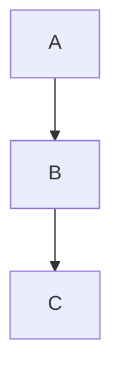

<!-- section:getting-started -->
# Bắt đầu

**VanFolio** là trình soạn thảo markdown không gây phân tâm, dành cho writers và developers.

## Tạo tài liệu mới

- Mở VanFolio — một tab **Untitled** trống sẽ tự động mở
- Bắt đầu gõ markdown ngay lập tức
- Lưu bằng **Ctrl+S** — lần đầu sẽ được hỏi vị trí lưu
- Lưu bản sao sang vị trí khác bằng **Ctrl+Shift+S**

## Mở file có sẵn

- **Tệp → Mở Tệp** hoặc **Ctrl+O**
- Kéo file `.md` trực tiếp vào cửa sổ editor
- File gần đây hiển thị trong panel **Files** (thanh bên trái)

## Tab

- Nhấn **+** để mở tab mới trống
- Mở nhiều file cùng lúc — mỗi file một tab riêng
- Thay đổi chưa lưu hiển thị dấu **●** trên tab
- Đóng tab bằng **×** hoặc click chuột giữa

## Tự động lưu

Sau khi file đã được lưu lên ổ đĩa ít nhất một lần, VanFolio sẽ tự động lưu khi bạn gõ.

## Khôi phục phiên

Khi mở lại VanFolio, các tab và nội dung trước đó sẽ được khôi phục tự động — kể cả các tài liệu Untitled chưa lưu.

---

<!-- section:writing-and-tabs -->
# Viết & Tab

## Slash Commands

Gõ `/` ở bất kỳ đâu trong editor để mở command palette.

| Lệnh | Kết quả |
|---|---|
| `/h1` `/h2` `/h3` | Tiêu đề |
| `/bullet` | Danh sách bullet |
| `/numbered` | Danh sách có số thứ tự |
| `/todo` | Danh sách việc cần làm |
| `/codeblock` | Khối code |
| `/table` | Bảng markdown |
| `/quote` | Blockquote |
| `/hr` | Đường kẻ ngang |
| `/pagebreak` | Ngắt trang cưỡng bức |
| `/link` | Chèn liên kết |
| `/image` | Chèn hình ảnh |
| `/mermaid` | Khối sơ đồ Mermaid |
| `/code` | Mã inline |
| `/katex` | Khối toán KaTeX |

## Trạng thái chưa lưu

Dấu **●** trên tab nghĩa là file có thay đổi chưa lưu. Tự động lưu sẽ xóa dấu này khi file đã ở trên ổ đĩa.

## Kéo và thả

- Kéo file `.md` vào cửa sổ editor để mở trong tab mới
- Kéo file hình ảnh vào editor — VanFolio sẽ sao chép vào thư mục `./assets/` cạnh tài liệu và tự chèn link markdown đúng cú pháp

---

<!-- section:markdown-and-media -->
# Markdown & Media

VanFolio render markdown **CommonMark** với các tính năng mở rộng cho bảng, code, toán học và sơ đồ.

## Định dạng văn bản

| Cú pháp | Kết quả |
|---|---|
| `**đậm**` | **đậm** |
| `*nghiêng*` | *nghiêng* |
| `` `code` `` | `code` |
| `~~gạch ngang~~` | ~~gạch ngang~~ |

## Tiêu đề

```
# Tiêu đề 1
## Tiêu đề 2
### Tiêu đề 3
```

## Danh sách

```
- Mục bullet

1. Mục có số

- [ ] Việc cần làm
- [x] Việc đã xong
```

## Liên kết & Hình ảnh

```
[Tên liên kết](https://example.com)

```

## Khối code

````
```javascript
console.log("Xin chào VanFolio")
```
````

Ngôn ngữ hỗ trợ: `javascript`, `typescript`, `python`, `bash`, `css`, `html`, `json` và nhiều hơn.

## Bảng

```
| Cột A | Cột B |
|---|---|
| Ô 1   | Ô 2   |
```

## Blockquote

```
> Đây là một blockquote
```

## Đường kẻ ngang

```
---
```

## Sơ đồ Mermaid

````

````

## Toán học KaTeX

Khối toán:

```
$$
E = mc^2
$$
```

Toán nội tuyến: `$a^2 + b^2 = c^2$`

---

<!-- section:preview-and-layout -->
# Preview & Layout

## Preview trực tiếp

Panel bên phải hiển thị preview markdown được render, cập nhật theo thời gian thực khi bạn gõ.

Preview sử dụng **layout phân trang kiểu in** — những gì bạn thấy phản ánh sát cách tài liệu sẽ trông khi xuất ra PDF.

## Mục lục (TOC)

Nhấn **Ctrl+\\** để bật/tắt thanh bên TOC. Các tiêu đề trong tài liệu hiển thị dạng cây điều hướng — nhấn bất kỳ tiêu đề nào để chuyển đến phần đó trong preview.

## Tách cửa sổ Preview

Nhấn **Ctrl+Alt+D** để mở preview trong cửa sổ riêng. Hữu ích khi dùng màn hình đôi.

## Chế độ Tập trung

Nhấn **Ctrl+Shift+F** để vào Chế độ Tập trung — tất cả panels ẩn đi, văn bản xung quanh bị mờ, giao diện thu gọn tối giản. Nhấn **Escape** để thoát.

## Chế độ Typewriter

Nhấn **Ctrl+Shift+T** để giữ dòng hiện tại ở giữa màn hình khi gõ. Giảm mỏi mắt khi viết tài liệu dài.

## Làm mờ ngữ cảnh

Nhấn **Ctrl+Shift+D** để làm mờ tất cả dòng trừ đoạn đang soạn.

---

<!-- section:export -->
# Xuất file

Mở hộp thoại Xuất từ menu **Xuất**. Nhấn **Ctrl+E** để xuất trực tiếp dạng PDF.

## Định dạng

| Định dạng | Ghi chú |
|---|---|
| **PDF** | Độ trung thực cao, dùng Chromium renderer |
| **HTML** | Độc lập — hình ảnh nhúng dạng base64 |
| **DOCX** | Tương thích Microsoft Word 365 |
| **PNG** | Chụp màn hình preview, theo từng trang |

## Tùy chọn PDF

- **Khổ giấy** — A4, A3 hoặc Letter
- **Hướng** — Dọc hoặc Ngang
- **Bao gồm TOC** — Mục lục tự sinh ở đầu tài liệu
- **Số trang** — Đánh số trang ở chân trang
- **Watermark** — Chữ phủ tùy chọn

## Tùy chọn HTML

- **Độc lập** — Tất cả hình ảnh và style nhúng trong một file `.html` duy nhất

## Tùy chọn DOCX

- Tương thích Word 365
- Toán học (KaTeX) render dạng văn bản thuần trong DOCX

## Tùy chọn PNG

- **Tỷ lệ** — Hệ số độ phân giải (1×, 2×)
- **Nền trong suốt** — Xuất với nền trong suốt thay vì trắng

---

<!-- section:collections-and-vault -->
# Collections & Vault

## Panel Files

Panel **Files** (thanh bên trái, biểu tượng đầu tiên) hiển thị các file đã mở gần đây. Nhấn bất kỳ file nào để mở lại.

## Trình khám phá thư mục

Dùng **Tệp → Mở Thư mục** hoặc **Ctrl+Shift+O** để mở một thư mục làm vault.

- Điều hướng cây thư mục ở thanh bên
- Nhấn bất kỳ file `.md` nào để mở trong tab mới

## Vault

Vault là thư mục bạn đã mở trong VanFolio. VanFolio ghi nhớ thư mục cuối cùng và tự mở lại khi khởi động lần sau.

## Onboarding

Lần đầu mở VanFolio, luồng onboarding sẽ hướng dẫn bạn tạo hoặc mở vault và bắt đầu với tài liệu đầu tiên.

## Chế độ Khám phá

Mới dùng VanFolio? Panel **Discovery** (biểu tượng bóng đèn ở thanh bên) hướng dẫn các tính năng chính theo từng bước.

---

<!-- section:settings-and-typography -->
# Cài đặt & Typography

Mở Cài đặt qua biểu tượng **⚙ bánh răng** ở cuối thanh bên trái.

## Giao diện (Theme)

| Theme | Phong cách |
|---|---|
| **Van Ivory** | Parchment ấm, editorial — sáng |
| **Dark Obsidian** | Tối sâu, bề mặt kính — tương phản cao |
| **Van Botanical** | Xanh sage, lấy cảm hứng từ thiên nhiên — sáng |
| **Van Chronicle** | Mực tối — tối giản, tập trung |

## Ngôn ngữ

Thay đổi ngôn ngữ giao diện trong **Cài đặt Chung**. Hỗ trợ: English, Tiếng Việt, 日本語, 한국어, Deutsch, 中文, Português (BR), Français, Русский, Español.

## Editor

- **Cỡ chữ** — Kích thước chữ editor tính theo px
- **Khoảng cách dòng** — Giãn cách giữa các dòng
- **Khoảng cách đoạn** — Khoảng cách thêm giữa các đoạn

## Typography

- **Font chữ** — Chọn từ font có sẵn hoặc tải font tùy chỉnh
- **Dấu ngoặc thông minh** — Tự chuyển `"thẳng"` thành `"cong"`
- **Clean Prose** — Xóa khoảng trắng thừa khi xuất
- **Làm nổi tiêu đề** — Làm nổi bật tiêu đề H1 của tài liệu

## Chế độ gọn

Giảm padding trong toàn bộ giao diện để hiển thị dày hơn. Hữu ích trên màn hình nhỏ.

---

<!-- section:archive-and-safety -->
# Lưu trữ & Bảo toàn

## Lịch sử phiên bản

VanFolio tự động lưu snapshot tài liệu khi bạn làm việc.

Mở **Lịch sử Phiên bản** từ menu **Tệp** để duyệt các trạng thái trước của file hiện tại. Nhấn vào snapshot bất kỳ để xem trước, sau đó khôi phục bằng một cú nhấn.

## Giữ lại

Cấu hình số lượng snapshot giữ lại cho mỗi file trong **Cài đặt → Lưu trữ & Bảo toàn**.

## Sao lưu cục bộ

VanFolio có thể ghi bản sao lưu của file vào thư mục riêng trên ổ đĩa.

Cấu hình trong **Cài đặt → Lưu trữ & Bảo toàn**:

- **Thư mục sao lưu** — Nơi lưu file sao lưu
- **Tần suất sao lưu** — Sao lưu định kỳ bao lâu một lần (ví dụ: 5 phút)
- **Sao lưu khi xuất** — Tự tạo bản sao lưu mỗi khi xuất file
