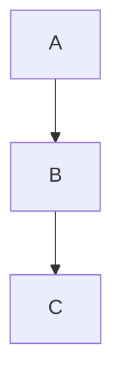

<!-- section:getting-started -->
# 开始使用

**VanFolio** 是一款专为作家和开发者设计的沉浸式 Markdown 编辑器。

## 创建新文档

- 启动 VanFolio —— 一个空白的 **无标题 (Untitled)** 标签页会自动打开。
- 立即开始编写 Markdown 内容。
- 使用 **Ctrl+S** 保存 —— 第一次保存时系统会提示您选择存储位置。
- 使用 **Ctrl+Shift+S** 将副本保存到不同位置。

## 打开现有文件

- **文件 → 打开文件** 或 **Ctrl+O**
- 将 `.md` 文件直接拖拽到编辑器窗口。
- 最近的文件会列在左侧工具栏的 **文件 (Files)** 面板中。

## 标签页

- 点击 **+** 打开一个新的空页面。
- 同时打开多个文件 —— 每个文件都有独立的标签页。
- 未保存的更改会在标签页上显示一个 **●** 圆点。
- 使用 **×** 或 鼠标中键 关闭标签页。

## 自动保存

文件在磁盘上完成首次保存后，VanFolio 会在您输入时自动执行保存。

## 会话恢复

重新启动 VanFolio 时，之前的标签页和内容会自动恢复 —— 即使是未保存的无标题文档也会保留。

---

<!-- section:writing-and-tabs -->
# 写作与标签

## 斜杠命令 (Slash Commands)

在编辑器中输入 `/` 即可打开命令面板。

| 命令 | 结果 |
|---|---|
| `/h1` `/h2` `/h3` | 标题 (Headings) |
| `/bullet` | 无序列表 |
| `/numbered` | 有序列表 |
| `/todo` | 待办清单 |
| `/codeblock` | 代码块 |
| `/table` | Markdown 表格 |
| `/quote` | 引用块 |
| `/hr` | 水平分割线 |
| `/pagebreak` | 强制分页符 |
| `/link` | 插入链接 |
| `/image` | 插入图像 |
| `/mermaid` | Mermaid 图表块 |
| `/code` | 行内代码 |
| `/katex` | KaTeX 数学公式块 |

## 未保存状态

标签页上的 **●** 圆点表示该文件有未保存的更改。执行自动保存后，该圆点会自动消失。

## 拖放操作

- 将 `.md` 文件拖入窗口可在新标签页中打开。
- 将图像文件拖入编辑器 —— VanFolio 会将其复制到文档所在目录的 `./assets/` 文件夹中，并自动插入正确的 Markdown 图像链接。

---

<!-- section:markdown-and-media -->
# Markdown与媒体

VanFolio 支持标准 Markdown，并扩展了表格、代码高亮、数学公式和图表功能。

## 文本格式化

| 语法 | 输出 |
|---|---|
| `**加粗**` | **加粗** |
| `*斜体*` | *斜体* |
| `` `代码` `` | `代码` |
| `~~删除线~~` | ~~删除线~~ |

## 标题

```
# 标题 1
## 标题 2
### 标题 3
```

## 列表

```
- 无序列表项

1. 有序列表项

- [ ] 待办事项
- [x] 已完成事项
```

## 链接与图像

```
[链接文本](https://example.com)

```

## 代码块

````
```javascript
console.log("Hello VanFolio")
```
````

支持的语言：`javascript`, `typescript`, `python`, `bash`, `css`, `html`, `json` 等。

## 表格

```
| 列 A | 列 B |
|---|---|
| 单元格 1 | 单元格 2 |
```

## 引用块

```
> 这是一个引用块
```

## 水平分割线

```
---
```

## Mermaid 图表

````

````

## KaTeX 数学公式

块状公式：

```
$$
E = mc^2
$$
```

行内公式：`$a^2 + b^2 = c^2$`

---

<!-- section:preview-and-layout -->
# 预览与布局

## 实时预览

右侧面板实时显示 Markdown 渲染效果。它会随着您的输入同步更新。

预览采用 **分页打印布局** —— 您在屏幕上看到的样式与导出为 PDF 时的效果几乎一致。

## 目录 (TOC)

使用 **Ctrl+\\** 切换目录侧边栏。文档标题会以导航树形式显示 —— 点击标题即可跳转到对应部分。

## 分离预览

使用 **Ctrl+Alt+D** 在独立窗口中打开预览。非常适合双显示器办公。

## 禅模式 (Focus Mode)

使用 **Ctrl+Shift+F** 进入禅模式 —— 所有面板都会隐藏，周围文字暗化，让您完全专注于写作。按 **Escape** 退出。

## 打字机模式

使用 **Ctrl+Shift+T** 让正在输入的行始终保持在屏幕垂直中心。减少长文档编写时的视线移动。

## 上下文暗化 (Fade Context)

使用 **Ctrl+Shift+D** 暗化除当前编辑段落外的所有行。

---

<!-- section:export -->
# 导出

从 **导出 (Export)** 菜单打开导出对话框。使用 **Ctrl+E** 可直接导出为 PDF。

## 支持格式

| 格式 | 说明 |
|---|---|
| **PDF** | 高精度输出，基于 Chromium 渲染引擎 |
| **HTML** | 独立文件形式 —— 图像以 base64 嵌入 |
| **DOCX** | 兼容 Microsoft Word 365 |
| **PNG** | 按页面捕获预览界面的截图 |

## PDF 选项

- **纸张大小** — A4, A3 或 Letter
- **方向** — 纵向 (Portrait) 或 横向 (Landscape)
- **包含目录** — 在文档开头自动生成目录
- **页码** — 页脚显示页码
- **水印** — 可选文字覆盖

## HTML 选项

- **独立 (Self-contained)** — 所有图像和样式都嵌入其中；单一便携式 `.html` 文件

## DOCX 选项

- 兼容 Microsoft Word 365
- 数学公式 (KaTeX) 在 DOCX 中将渲染为普通文本

## PNG 选项

- **缩放** — 分辨率倍数 (1×, 2×)
- **透明背景** — 导出透明背景（而非白色背景）

---

<!-- section:collections-and-vault -->
# 集合与Vault

## 文件面板

**文件 (Files)** 面板（左侧工具栏第一个图标）显示您最近打开的文件。点击即可重新启动。

## 文件夹资源管理器

使用 **文件 → 打开文件夹** 或 **Ctrl+Shift+O** 将文件夹作为 "Vault" (保藏库) 打开。

- 在侧边栏导航文件夹树
- 点击 `.md` 文件可在新标签页中打开

## Vault (保藏库)

Vault 是您在 VanFolio 中打开的文件夹。VanFolio 会记住您最后一次打开的文件夹，并在下次启动时自动重新加载。

## 引导 (Onboarding)

当您首次启动 VanFolio 时，向导将帮助您创建或打开一个 Vault 并开始第一篇文档。

## 探索模式 (Discovery)

VanFolio 新手？侧边栏的灯泡图标可打开 **探索** 面板，以互动方式带您了解各项核心功能。

---

<!-- section:settings-and-typography -->
# 设置与排版

点击左侧工具栏底部的 **⚙ 齿轮图标** 打开设置。

## 主题

| 主题 | 风格 |
|---|---|
| **Van Ivory** | 温馨羊皮纸，编辑风格 —— 浅色 |
| **Dark Obsidian** | 深邃黑，玻璃质感 —— 高对比度 |
| **Van Botanical** | 鼠尾草绿，自然启发 —— 浅色 |
| **Van Chronicle** | 墨色深蓝 —— 极简专注环境 |

## 语言 (Language)

在 **常规 (General)** 设置中更改界面语言。支持语言：英语、越南语、日语、韩语、德语、中文、葡萄牙语 (巴西)、法语、俄语、西班牙语。

## 编辑器

- **字体大小** — 编辑器文本大小 (px)
- **行高** — 文本行之间的垂直间距
- **段落间距** — 段落之间的额外空隙

## 排版

- **字体系列** — 选择内置字体或加载外部字体文件
- **智能引号 (Smart Quotes)** — 自动将直引号 (`" "`) 转换为圆引号
- **洁净文本 (Clean Prose)** — 导出时删除多余空格并整理空白
- **标题突出显示** — 视觉上强调文档的 H1 标题

---

<!-- section:archive-and-safety -->
# 归档与安全

## 版本历史

VanFolio 会在您编写时自动为文档保存快照。

通过 **文件** 菜单打开 **版本历史** 以浏览文件的历史状态。点击快照进行预览，单击即可一键恢复。

## 保留策略

您可以在 **设置 → 归档与安全** 中配置每个文件保留的快照数量。

## 本地备份

除了版本历史外，VanFolio 还可以将文件的副本备份到磁盘上的独立文件夹中。

在 **设置 → 归档与安全** 中进行配置：

- **备份文件夹** — 备份文件的保存位置
- **备份频率** — 写入备份的时间间隔（如每 5 分钟）
- **导出时备份** — 导出文件时自动创建副本
